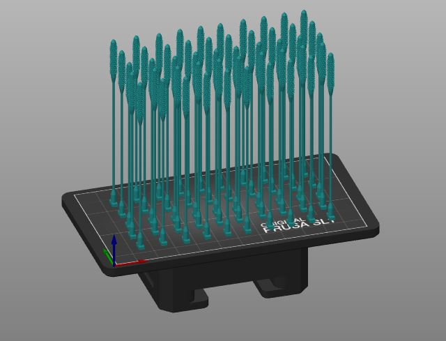

# Open Source Nasopharyngeal Swab and UV Curing System

This repository hosts the open-source design files, instructions, and validation results for a parametric nasopharyngeal swab and UV curing system. The designs are tailored for distributed manufacturing using accessible 3D printing technologies. Originally developed to address swab shortages during the COVID-19 pandemic, this project aims to provide a low-cost, scalable solution for clinical testing and other medical applications.

## Features

- **Parametric Design:** Fully customizable in OpenSCAD to adapt swab and handle features for specific needs.
  - Tested with [github.com/CameronBrooks11/OpenSCAD-Batch-Export](https://github.com/CameronBrooks11/OpenSCAD-Batch-Export)
- **Distributed Manufacturing:** Designed for SLA 3D printers and modular UV curing systems, enabling local production with low-cost, accessible equipment.
- **Validated Performance:** Mechanical testing ensures durability and safety for clinical applications.
- **Open Source:** Licensed under GNU GPL v3.0 and CERN OHL v1.2 for maximum accessibility and collaboration.

## Cost Overview

- Nasopharyngeal Swabs:
  - Press-fit handle: ~$0.06/swab
  - Tong-style handle: ~$0.11/swab
- Modular UV Curing System: $45 total

## Included Components

1. **Swab Design Files:**
   - Parametric OpenSCAD files for the swab and handle.
   - STL files for SLA and FFF printers.
2. **UV Curing System:**
   - Design files for modular PCBs and 3D printable components.
   - Assembly instructions and parts list.

## Bill of Materials (BOM)

- **Swabs:** UV resin for swab heads and thermoplastics (e.g., PLA, PETG) for handles.
- **UV System:** Modular PCB components, UV LEDs, 3D printed brackets, and power supply.

## How to Use

### Swab Fabrication

1. Print swab heads using SLA 3D printers.
2. Print handles using FFF 3D printers.
3. Assemble and cure swabs in the UV curing system.

### UV Curing System Assembly

1. Solder PCBs and assemble the modular curing box.
2. Connect power and ensure system functionality with a multimeter.

### Validation

- Follow the provided mechanical testing protocols for tensile strength and break points.
- Conduct clinical testing in accordance with FDA or regional guidelines.

## Licensing

This project is licensed under:

- GNU General Public License (GPL) v3.0
- CERN Open Hardware License (OHL) v1.2

## Contributing

Contributions to improve the design, validation, or documentation are welcome. Please open an issue or submit a pull request.

## Citation

If you use this project in your work, please cite the original paper:  
Gallup, N., Pringle, A. M., Oberloier, S., Tanikella, N. G., & Pearce, J. M. (2020). *Parametric nasopharyngeal swab for sampling COVID-19 and other respiratory viruses: Open source design, SLA 3-D printing and UV curing system*. HardwareX, 8, e00135.

## Acknowledgments

This work was supported by the Witte Foundation and benefited from the contributions of numerous collaborators listed in the publication.

For more details, visit the [source paper](https://doi.org/10.1016/j.ohx.2020.e00135) or access original files on the [Open Science Framework (OSF)](https://osf.io/z5jgu/).
